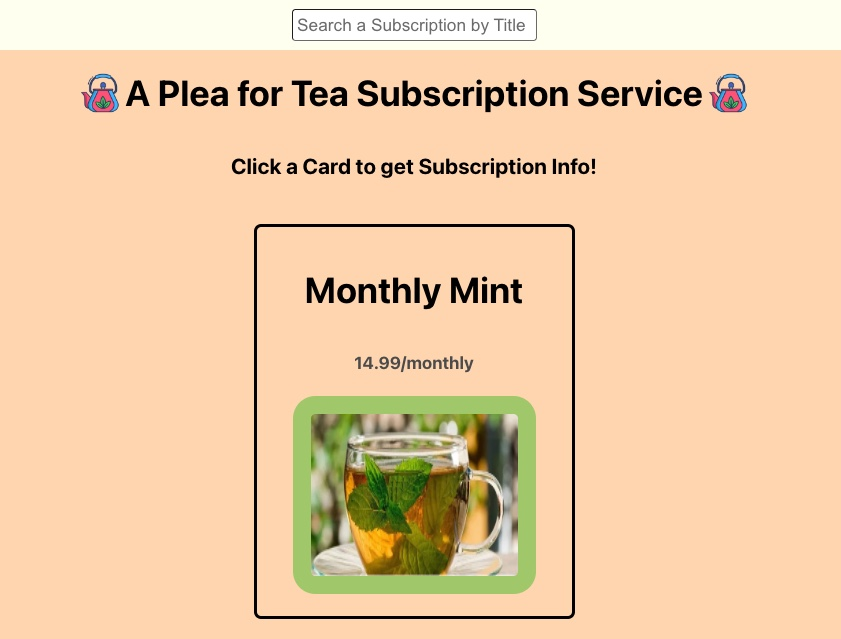

<h1 align="center"> A Plea for Tea </h1>

[GitHub Project Board](https://github.com/users/stefanjbloom/projects/6/views/1)

[Figma Planning Project Board](https://www.figma.com/board/JvmcRrFbD15GfceepoTn96/teaShop?node-id=0-1&node-type=canvas&t=6IpfXCnRrVl6NuU3-0)

"A Plea for Tea" is a full-stack web app that creates an admin portal for viewing and managing tea subscriptions through a rudimentary online shop. It's interactivity includes routing, a cancellation option and responsive views.

<h2 align="center"> Context </h2>

"A Plea for Tea" is a demonstration of my knowledge building a back-end API with Ruby on Rails and a React front-end. This project took me about 18 hours.

<h2 align="center"> Tech </h2>

BE - Ruby on Rails, tested with RSpec & simplecov

FE - Built with React

<h2 align="center"> Installation </h2>

1. Fork and clone this BE repo 
[a-plea-for-tea-BE repo](https://github.com/stefanjbloom/a-plea-for-tea-be)
2. `cd` into the repo
2. Run these commands in your terminal
  - `bundle install`
  -  `rails db:{drop, create, migrate, seed}`
  -  `rails s`

4. Fork this FE repo
[a-plea-for-tea-fe repo](https://github.com/stefanjbloom/a-plea-for-tea-fe)
5. `cd` into cloned repo
6. Run `npm install`
7. Run `npm start`
8.  Enter `control + c` in your terminal to stop running the React app at any time

<h2 align="center"> Author </h2>

Stefan Bloom - [linkedin](https://www.linkedin.com/in/stefanjbloom/) - [gitHub](https://github.com/stefanjbloom) - stefanjbloom88@gmail.com

